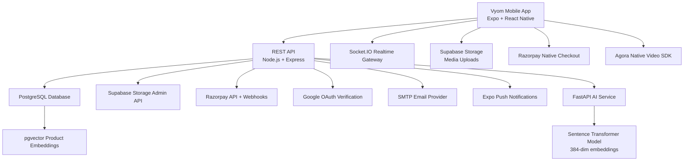
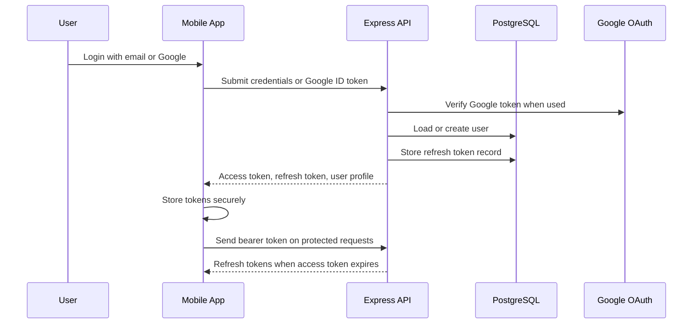
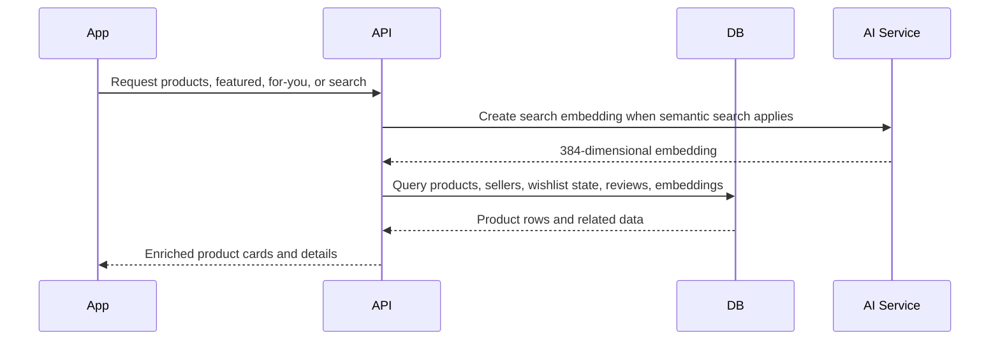
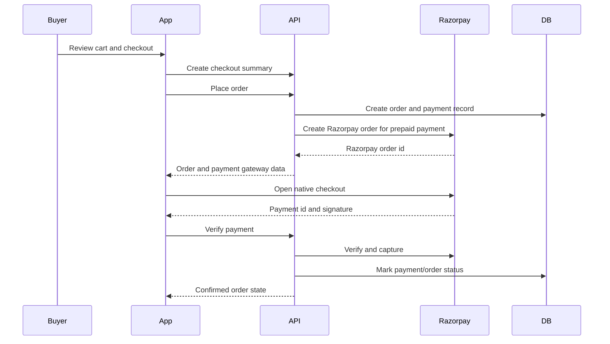
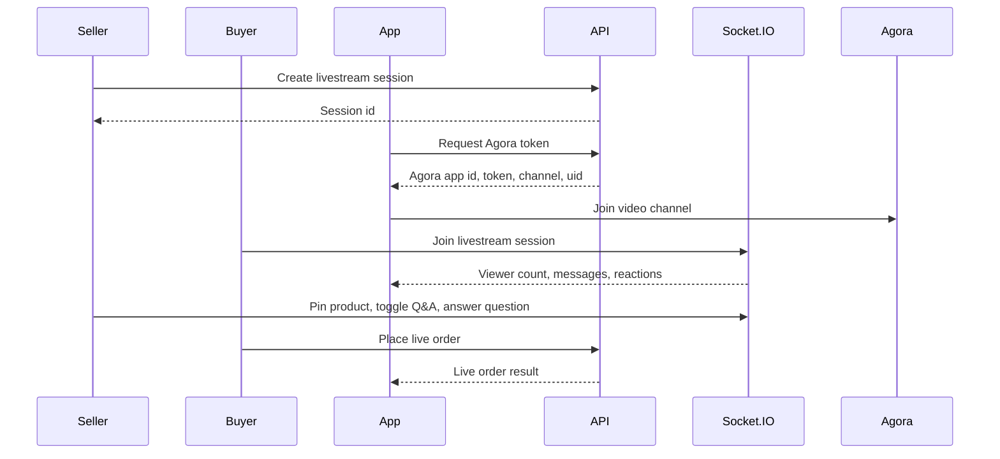

# System Architecture

## High-Level Architecture

## Runtime Components

### Mobile Client

The mobile app handles navigation, UI state, auth token storage, media picking, checkout screens, livestream UI, and realtime socket connections. It calls the backend through an Axios client that attaches bearer tokens and refreshes expired access tokens.

### API Server

The backend exposes versioned REST routes under `/api/v1`. It validates requests, enforces authentication, reads and writes PostgreSQL data, talks to external services, sends standardized responses, and manages webhooks.

### Realtime Server

Socket.IO powers two major realtime areas:

- `/inbox` namespace for chat, typing, read receipts, order updates, alerts, and reactions.
- `/livestream` namespace for session joins, viewer counts, messages, reactions, pinned products, Q&A, and session end events.

### AI Recommendation Service

The FastAPI service creates normalized text embeddings for products. The backend can request embeddings and store them in PostgreSQL with pgvector for semantic search and recommendation behavior.

### Database

PostgreSQL stores business data. Major domains include:

- Users and authentication tokens
- Products and product reviews
- Posts, likes, saves, follows, and feed data
- Stories, story views, and reactions
- Livestream sessions, messages, Q&A, and pinned products
- Cart, wishlist, and wishlist collections
- Orders, order items, tracking, coupons, payments, refunds, and disbursements
- Seller onboarding, seller bank accounts, and seller dashboard data
- Inbox conversations, messages, reactions, alerts, and read states

## Authentication Flow

## Product Discovery Flow

## Checkout Flow

## Livestream Flow

## Scalability Considerations

- REST routes are separated by domain, which makes it easier to scale features independently.
- Cached GET responses in the mobile Axios layer reduce repeated network calls.
- Realtime traffic is separated into inbox and livestream namespaces.
- Product embeddings are isolated in a lightweight AI service.
- Database indexes exist for frequent filters: users, products, ratings, locations, posts, livestreams, stories, orders, payments, wishlists, inbox, and vector search.

